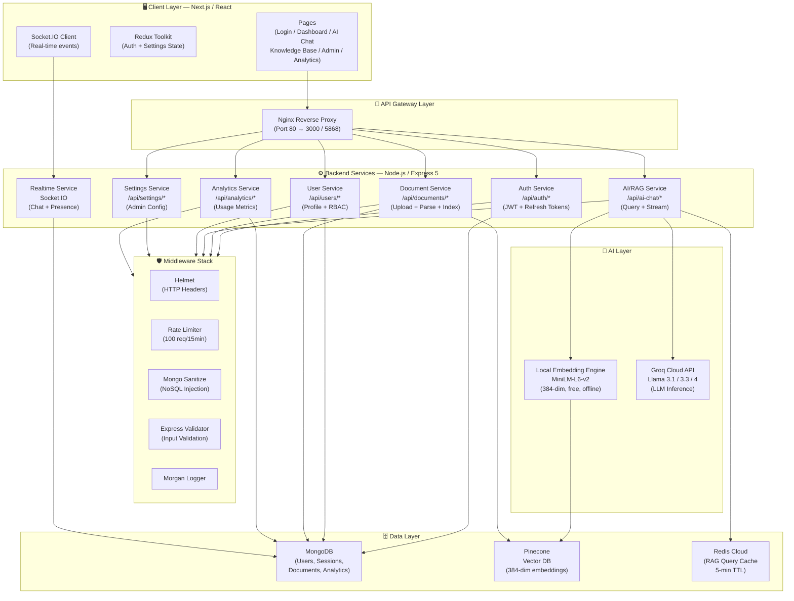
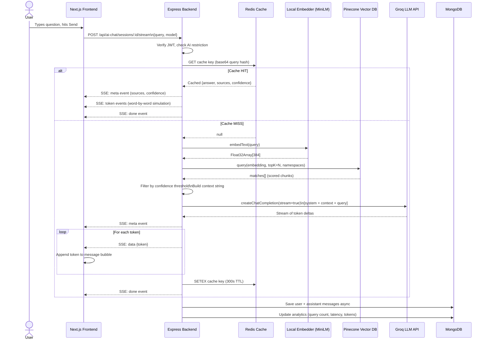
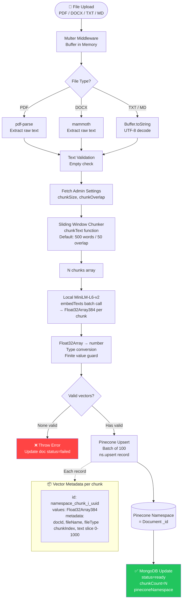
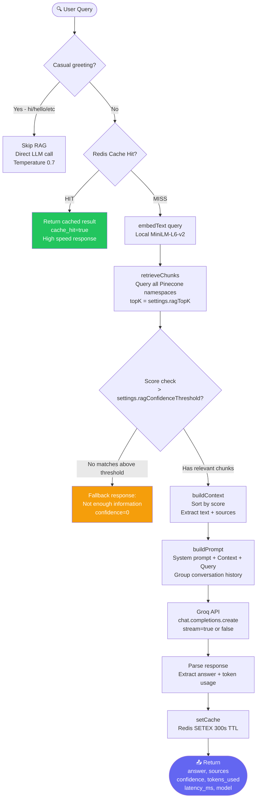

# NeuroDesk — System Architecture & Data Flow Diagrams

## 1. System Architecture

---

## 2. Data Flow Diagram — User Query Flow

---

## 3. RAG Pipeline Diagram — Document Ingestion

---

## 4. RAG Pipeline — Query Retrieval

