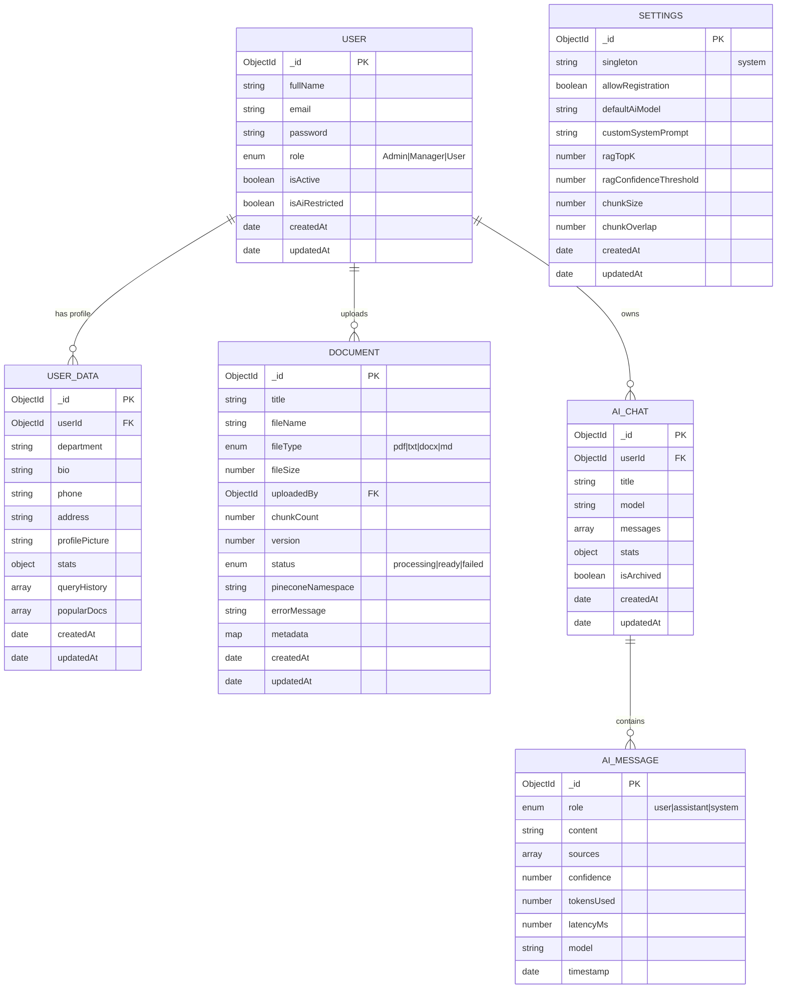

# NeuroDesk — Database Schema Documentation

## MongoDB Collections Overview

---

## Collection Field Details

### `users`

| Field            | Type     | Required | Description                                          |
| ---------------- | -------- | -------- | ---------------------------------------------------- |
| `_id`            | ObjectId | ✅       | Auto-generated primary key                           |
| `fullName`       | String   | ✅       | Display name (trimmed)                               |
| `email`          | String   | ✅       | Unique, lowercase, used for login                    |
| `password`       | String   | ✅       | bcrypt hashed (10 rounds)                            |
| `role`           | Enum     | ✅       | `Admin` / `Manager` / `User`                         |
| `isActive`       | Boolean  | —        | `true` by default. `false` = blocked from login      |
| `isAiRestricted` | Boolean  | —        | `false` by default. `true` = AI endpoints return 403 |
| `createdAt`      | Date     | —        | Mongoose timestamp                                   |
| `updatedAt`      | Date     | —        | Mongoose timestamp                                   |

---

### `userdatas`

| Field                     | Type            | Description                                                |
| ------------------------- | --------------- | ---------------------------------------------------------- |
| `userId`                  | ObjectId → User | Unique FK reference                                        |
| `department`              | String          | Optional department tag                                    |
| `bio`                     | String          | Optional biography (max 500 chars)                         |
| `phone`                   | String          | Optional phone number                                      |
| `address`                 | String          | Optional address                                           |
| `profilePicture`          | String          | URL to hosted profile image                                |
| `stats.totalQueries`      | Number          | Incremented on every AI query                              |
| `stats.totalTokensUsed`   | Number          | Sum of all Groq token usage                                |
| `stats.avgLatencyMs`      | Number          | Running average of query latency                           |
| `stats.errorRate`         | Number          | Fraction of failed queries                                 |
| `stats.totalCostEstimate` | Number          | USD cost estimate                                          |
| `stats.docsUploaded`      | Number          | Count of uploaded documents                                |
| `stats.lastActive`        | Date            | Updated on every request                                   |
| `queryHistory[]`          | Array           | Last 50 query records with keyword, model, latency, tokens |
| `popularDocs[]`           | Array           | Most-queried document IDs                                  |

---

### `documents`

| Field               | Type            | Description                            |
| ------------------- | --------------- | -------------------------------------- |
| `title`             | String          | Display name (from upload or filename) |
| `fileName`          | String          | Original filename with extension       |
| `fileType`          | Enum            | `pdf` / `txt` / `docx` / `md`          |
| `fileSize`          | Number          | Bytes                                  |
| `uploadedBy`        | ObjectId → User | Ref populated for display              |
| `chunkCount`        | Number          | Set after Pinecone upsert              |
| `version`           | Number          | Starts at 1, increments on re-index    |
| `status`            | Enum            | `processing` → `ready` / `failed`      |
| `pineconeNamespace` | String          | `= document._id.toString()`            |
| `errorMessage`      | String          | Only set on `failed`                   |
| `metadata`          | Map\<String\>   | Extensible key-value pairs             |

---

### `aichats`

| Field                   | Type                        | Description                        |
| ----------------------- | --------------------------- | ---------------------------------- |
| `userId`                | ObjectId → User             | Session owner                      |
| `title`                 | String                      | Auto-generated from first query    |
| `model`                 | String                      | Active Groq model ID               |
| `messages[]`            | Array of embedded AiMessage | Full conversation history          |
| `messages[].role`       | Enum                        | `user` / `assistant` / `system`    |
| `messages[].content`    | String                      | Message text                       |
| `messages[].sources`    | Array                       | Document filenames cited           |
| `messages[].confidence` | Number                      | Avg Pinecone similarity score      |
| `messages[].tokensUsed` | Number                      | Groq token count for this response |
| `messages[].latencyMs`  | Number                      | End-to-end response time           |
| `messages[].model`      | String                      | Model used for this response       |
| `stats.totalMessages`   | Number                      | Total message count                |
| `stats.totalTokens`     | Number                      | Sum of all tokensUsed              |
| `stats.avgLatency`      | Number                      | Average of all latencyMs values    |
| `isArchived`            | Boolean                     | Soft-delete flag                   |

---

### `settings` (Singleton)

| Field                    | Type    | Default                  | Description                     |
| ------------------------ | ------- | ------------------------ | ------------------------------- |
| `singleton`              | String  | `"system"`               | Enforces exactly one document   |
| `allowRegistration`      | Boolean | `true`                   | Master registration switch      |
| `defaultAiModel`         | String  | `"llama-3.1-8b-instant"` | Default Groq model              |
| `customSystemPrompt`     | String  | (long default)           | Injected into every RAG query   |
| `ragTopK`                | Number  | `5`                      | Pinecone top-K per query        |
| `ragConfidenceThreshold` | Number  | `0.15`                   | Minimum similarity score        |
| `chunkSize`              | Number  | `500`                    | Words per document chunk        |
| `chunkOverlap`           | Number  | `50`                     | Sliding window overlap in words |

---

## Pinecone Vector Index

| Property                | Value                                                               |
| ----------------------- | ------------------------------------------------------------------- |
| **Index Name**          | Configured via `PINECONE_INDEX_NAME` env                            |
| **Dimensions**          | `384` (MiniLM-L6-v2 output)                                         |
| **Metric**              | Cosine similarity                                                   |
| **Namespace**           | One per document (`= document._id.toString()`)                      |
| **Vector ID Format**    | `{namespace}_chunk_{i}_{uuid}`                                      |
| **Metadata per vector** | `docId`, `fileName`, `fileType`, `chunkIndex`, `text` (≤1000 chars) |

---

## Redis Cache Schema

| Key Pattern               | Value                                                                 | TTL          |
| ------------------------- | --------------------------------------------------------------------- | ------------ |
| `rag:{base64-query-hash}` | JSON: `{answer, sources, confidence, tokens_used, latency_ms, model}` | 300s (5 min) |
