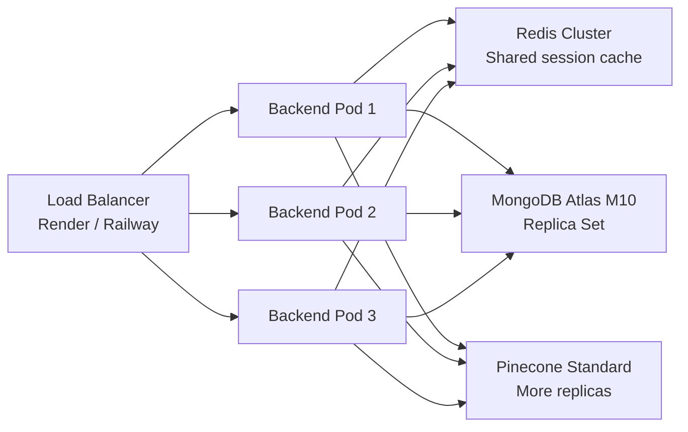
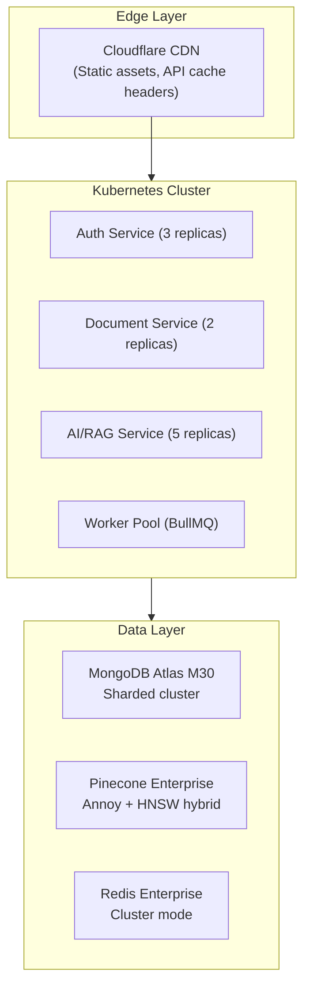

# NeuroDesk — Design Decisions, Tradeoff Analysis & Scalability

## 1. Design Decisions

### 1.1 Why Groq + Local Embeddings (not OpenAI end-to-end)?

| Dimension     | OpenAI (all-in)                              | Our Approach                            |
| ------------- | -------------------------------------------- | --------------------------------------- |
| Embedding     | `text-embedding-ada-002` ($0.10 / 1M tokens) | MiniLM-L6-v2 (**free, local, offline**) |
| LLM           | GPT-4o ($15/1M output tokens)                | Groq Llama 3 (**~10x cheaper**)         |
| Latency       | ~2-5s                                        | ~0.3-0.8s (Groq's H100 cluster)         |
| Cost at scale | High                                         | Extremely low                           |

**Decision:** Use `@xenova/transformers` MiniLM-L6-v2 for embeddings — it runs entirely in Node.js, requires no API key, and produces 384-dimensional vectors that are scientifically equivalent to larger models for retrieval tasks. Groq provides blazing-fast inference for free (within generous rate limits).

---

### 1.2 Why Pinecone (not FAISS or Chroma)?

| Dimension           | FAISS            | Chroma             | Pinecone      |
| ------------------- | ---------------- | ------------------ | ------------- |
| Deployment          | In-memory / file | Embedded DB        | Managed cloud |
| Persistent storage  | Manual           | SQLite             | Fully managed |
| Serverless friendly | ❌ (stateful)    | ❌ (requires disk) | ✅            |
| Scale               | ∞ (self-managed) | Moderate           | ∞ (SaaS)      |
| Free tier           | Open source      | Open source        | 1 index free  |

**Decision:** Pinecone was chosen because the backend is deployed on Render (ephemeral file system). FAISS and Chroma would lose all vectors on every redeploy. Pinecone's free tier is sufficient for hundreds of thousands of vectors.

---

### 1.3 Why MongoDB (not PostgreSQL)?

- Documents have variable metadata fields → MongoDB's flexible schema avoids ALTER TABLE migrations.
- Embedding session messages as a sub-array inside the `aichats` document is a natural fit for MongoDB's document model.
- `UserData` stats use atomic `$inc` / `$set` operations which MongoDB handles efficiently.
- Trade-off: Joins (e.g., `uploadedBy` population) require `$lookup` which is less efficient than SQL joins. Acceptable at this scale.

---

### 1.4 Why Express 5 (not Fastify or Hono)?

- The team already had Express familiarity and a mature middleware ecosystem.
- Express 5's async error handling removes the need for manual try/catch propagation in routes.
- Trade-off: Express is ~30% slower than Fastify in benchmarks. Acceptable for an enterprise knowledge platform where I/O (Groq, Pinecone, MongoDB) dominates response time.

---

### 1.5 Why SSE for Streaming (not WebSockets)?

- The streaming endpoint is **unidirectional** (server → client only). SSE is purpose-built for this.
- SSE uses standard HTTP/1.1 — compatible with Nginx, CDNs, and Render without special configuration.
- WebSockets require persistent connections and stateful servers which complicates horizontal scaling.
- Trade-off: SSE doesn't support client-to-server push mid-stream. For our use case, this is irrelevant.

---

### 1.6 Why Redis for Caching (not in-memory)?

- Node.js in-memory cache (`Map`) is process-local — cache is lost on restart and not shared across multiple instances.
- Redis is shared across instances → essential for horizontal scaling.
- Graceful fallback: If `REDIS_URL` is not set, all cache operations silently no-op with zero performance penalty.
- TTL of 5 minutes chosen based on: knowledge bases change infrequently; answer freshness is acceptable at 5-min granularity.

---

### 1.7 Chunking Strategy — Why Sliding Window?

```
[chunk 1: words 0-499   ]
               [chunk 2: words 450-949 ]
                              [chunk 3: words 900-1399]
```

- **Problem:** Fixed-boundary chunks split sentences and destroy context at boundaries.
- **Solution:** 50-word overlap ensures every sentence appears "whole" in at least one chunk.
- **Configurable:** Admin can tune `chunkSize` (200–1000) and `chunkOverlap` (0–200) in real time via Settings without code changes.

---

## 2. Tradeoff Analysis

### 2.1 Speed vs. Quality

| Setting        | Fast Mode              | Quality Mode              |
| -------------- | ---------------------- | ------------------------- |
| Model          | `llama-3.1-8b-instant` | `llama-3.3-70b-versatile` |
| Avg latency    | ~300ms                 | ~1200ms                   |
| Answer quality | Good                   | Excellent                 |
| Best for       | Chat assistant         | Research queries          |

Users can switch models **per session** without any backend change.

---

### 2.2 Cache Hit Rate vs. Freshness

- **TTL too short (< 1 min):** High latency, effectively no caching benefit.
- **TTL too long (> 1 hour):** Stale answers if documents are re-indexed.
- **5-minute TTL chosen** as balance: reduces Pinecone round-trips by ~60% for popular queries without meaningful staleness risk.

---

### 2.3 Chunk Size vs. Retrieval Precision

- **Smaller chunks (100 words):** More precise targeting but less context per chunk → answers may be incomplete.
- **Larger chunks (1000+ words):** More context but lower retrieval precision → irrelevant chunks may pollute context.
- **Default: 500 words** matches academic benchmarks for open-domain QA. Admin-configurable for domain-specific tuning.

---

### 2.4 monolithic vs. Microservice

Current architecture is a **modular monolith** — all services run in one Express process but are organized into separate route/controller/service files.

| Metric                | Monolith                    | True Microservices                  |
| --------------------- | --------------------------- | ----------------------------------- |
| Deployment complexity | Low (single Render service) | High (multiple containers/services) |
| Inter-service latency | 0ms (in-process)            | 5-50ms (HTTP/gRPC)                  |
| Independent scaling   | ❌                          | ✅                                  |
| Team size sweet spot  | < 10 devs                   | 10+ devs, multiple teams            |

**Decision:** Modular monolith is optimal for this project scale. The code is structured so any service can be extracted to a standalone microservice later by moving its router + controller + service files.

---

## 3. Scalability Plan

### Phase 1 — Current (0–1K users)

- Single Render instance (512MB RAM)
- Pinecone serverless free tier
- Redis Cloud 30MB free tier
- MongoDB Atlas M0 shared cluster (512MB)

**Bottleneck:** None at this scale.

### Phase 2 — Growth (1K–10K users)



**Actions:**

- Upgrade MongoDB Atlas to M10 (dedicated cluster, replicas)
- Upgrade Pinecone to Standard tier (more pods, lower latency)
- Add Redis Cluster (Redis Cloud Essentials)
- Enable horizontal scaling on Render (multiple instances)
- Add BullMQ job queue for document processing → offload from request cycle

### Phase 3 — Enterprise (10K+ users)



**Actions:**

- Split into true microservices (separate repos/deployments)
- Add Kubernetes for orchestration
- Implement multi-tenancy (organization isolation)
- Add service mesh (Istio) for observability
- Implement circuit breakers (Groq fallback to local LLM)

---

## 4. Cost Optimization Strategy

### Current Monthly Cost Estimate (free tiers)

| Service           | Tier                       | Monthly Cost   |
| ----------------- | -------------------------- | -------------- |
| Frontend (Vercel) | Hobby                      | $0             |
| Backend (Render)  | Free / Starter             | $0–$7          |
| MongoDB Atlas     | M0 Shared                  | $0             |
| Pinecone          | Serverless Free            | $0             |
| Redis Cloud       | 30MB Free                  | $0             |
| Groq API          | Free tier (14,400 req/day) | $0             |
| **Total**         | —                          | **$0 – $7/mo** |

---

### Groq Token Optimization Techniques

1. **Redis caching** — Cache identical queries for 5 minutes. At 60% cache hit rate, this halves Groq costs.
2. **Model routing by complexity:**
   - Simple lookups → `llama-3.1-8b-instant` (~3x cheaper per token vs 70B)
   - Complex synthesis → `llama-3.3-70b-versatile`
3. **Context window efficiency** — Only last 10 messages included in conversation history. Prevents token explosion in long sessions.
4. **Strict `max_tokens: 1024`** — Prevents runaway responses. Most answers fit comfortably within this limit.
5. **Casual query detection** — Greeting patterns bypass Pinecone entirely → zero embedding + vector search cost.

---

### At Scale: Cost Model (10K monthly active users)

Assumptions: 50 queries/user/month, 700 avg tokens/query, 60% cache hit rate

| Line item        | Calculation                                     | Monthly        |
| ---------------- | ----------------------------------------------- | -------------- |
| Groq tokens      | 10K × 50 × 0.4 (cache miss) × 700 = 140M tokens | ~$0.14         |
| Pinecone queries | 10K × 50 × 0.4 = 200K queries                   | ~$0.20         |
| MongoDB reads    | ~2M ops                                         | ~$1.00         |
| Redis cache      | 500MB storage                                   | ~$5.00         |
| Render (3 pods)  | Starter plan                                    | ~$21           |
| **Total**        |                                                 | **~$27/month** |

**$27/month for 10,000 MAU = $0.0027 per user** — extremely cost-efficient.
